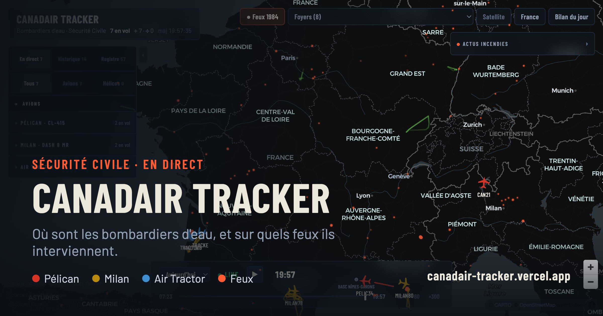

# Canadair Tracker

Suivi temps réel + replay des bombardiers d'eau de la Sécurité Civile française
(Canadair CL-415 « Pélican », Dash 8 MR « Milan », Air Tractors loués), avec
overlay des feux actifs (détections satellites VIIRS). Contexte : incendies de
l'été 2026, notamment Fontainebleau.

**Production : https://canadair-tracker.vercel.app** (repo GitHub public
`leannekoss/canadair-tracker`, deploy auto sur push `main`)



## Lancer en local

```bash
npm run dev        # → http://localhost:5173
```

Aucune clé API nécessaire. En dev, le proxy Vite (vite.config.js) gère les
endpoints à headers spécifiques ; en prod ce sont les fonctions `api/traces.js`
et `api/photos.js` (chemin fixe + `?hex=` — le routing catch-all `[...path]`
de Vercel ne matche qu'un segment hors Next.js).

## Utilisation

- **LIVE** : positions temps réel (poll 12 s), traîne des 2 dernières heures
- **Replay** : bouton ▶ ou déplacer le slider — rejoue la journée (×10/×60/×300)
- **Sélecteur de journée** : « Aujourd'hui » (traces 24 h glissantes airplanes.live)
  ou une journée archivée (`data/archive/`)
- Clic sur un appareil (carte ou strip) : fiche avec photo, alt/vitesse/cap,
  distance du jour, rotations
- **Feux** : hotspots VIIRS < 24 h, taille ∝ intensité (FRP), opacité ∝ fraîcheur
- **Légende** : clé de lecture des couleurs, toujours visible
- **Bandeau d'effort** : appareils, km, heures de vol, écopages estimés du jour
- **Foyers** : sélecteur des feux nommés par commune → fiche avec les appareils
  passés dessus (estimation ADS-B)
- **Saison** (`S`) : cumul de toutes les journées archivées (km, journée la plus
  intense, appareils les plus sollicités)

> La **détection amont** des départs de feu (avant la réponse aérienne suivie ici)
> relève de projets dédiés comme [kanari.io](https://kanari.io/).

## Sources de données (gratuites, validées 07/2026)

| Donnée | Source | Particularité |
|---|---|---|
| Positions live | `api.airplanes.live/v2/mil` (+ `/v2/type/AT8T` filtré France) | CORS ouvert |
| Trace du jour | `globe.airplanes.live/data/traces/{xx}/trace_full_{hex}.json` | exige header `Referer` → proxy |
| Photos | `api.planespotters.net/pub/photos/hex/{hex}` | exige User-Agent avec contact → proxy |
| Feux | ArcGIS Living Atlas `Satellite_VIIRS_Thermal_Hotspots_and_Fire_Activity` | champ `hours_old`, CORS ouvert |

Registre flotte : `data/fleet.json` (12 CL-415 + 6 Dash 8, hex bloc `3b7bxx`,
constitué via adsbdb.com). Les appareils inconnus de type bombardier immatriculés
F-Z* et les AT-802 au-dessus de la France sont **auto-découverts** par le poll live.

## Archivage quotidien

`scripts/collect-traces.mjs` télécharge chaque soir les traces, **filtre les points
sur la journée UTC étiquetée** et écrit `data/archive/YYYY-MM-DD/` + `index.json`.

- GitHub Action `collect-traces` (cron 21 h 45 UTC) : collecte + commit + push
  → le push redéploie Vercel, la journée apparaît dans le sélecteur
- Manuel : `node scripts/collect-traces.mjs` (ou `--hex a,b,c` / `--date YYYY-MM-DD`)

⚠️ `trace_full` est une **fenêtre glissante ~24 h** (pas la journée UTC) : sans le
filtre du collecteur, une collecte matinale archiverait les vols de la veille sous
la date du jour. Le cron tourne en fin de journée aérienne pour capter la journée
complète.

## Stack

React 18 · Vite 8 · Tailwind v4 · MapLibre GL (basemap CARTO dark) · deck.gl 9
(TripsLayer pour les trails animés). Palette catégorielle validée daltonisme
(ΔE ≥ 12) : Pélican `#d63426`, Milan `#b8880f`, Air Tractor `#3f8ed0`.
